# all Manual setup for lab 

## Ovirt-engine connection to hypervisor using -- VDSM 

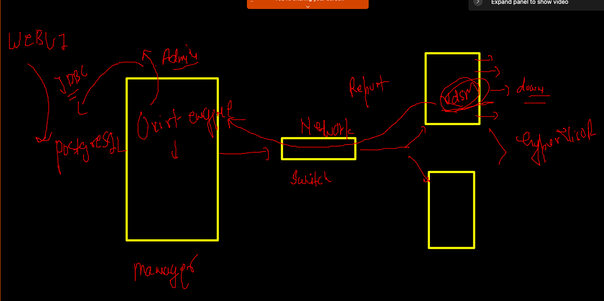

### checking hypervisor host 

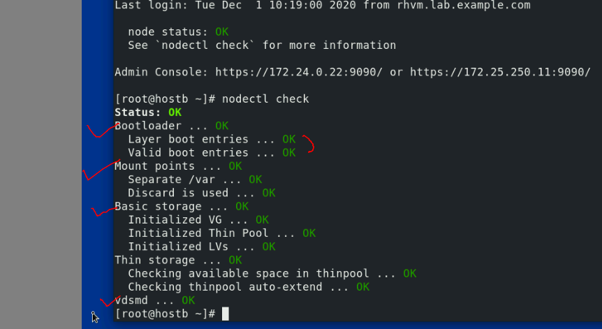

### more info about HYpervisor logs 

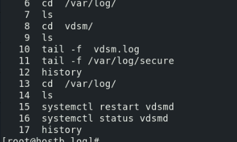

### maintaining disk 

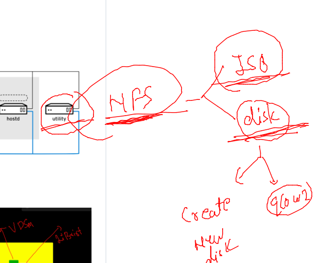

### NFS configured 

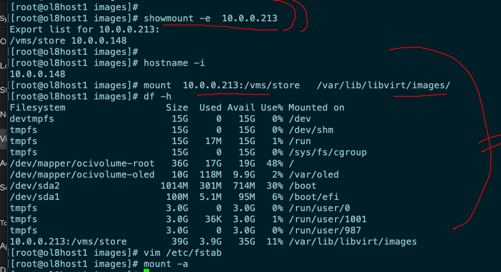

### Host maintaince 

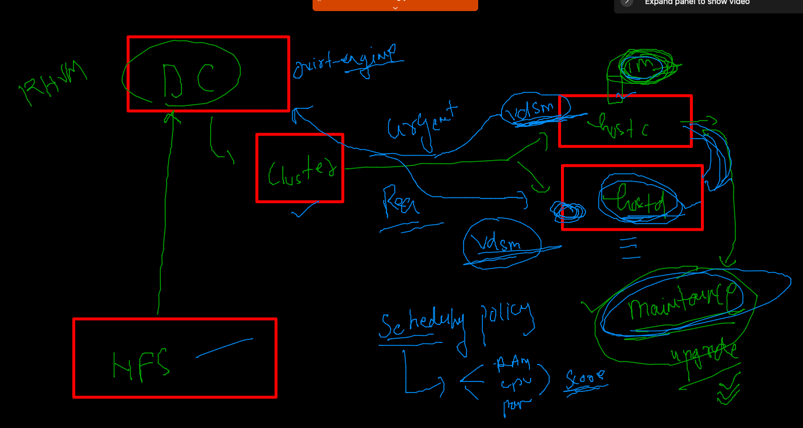

## Virtualization Networking 

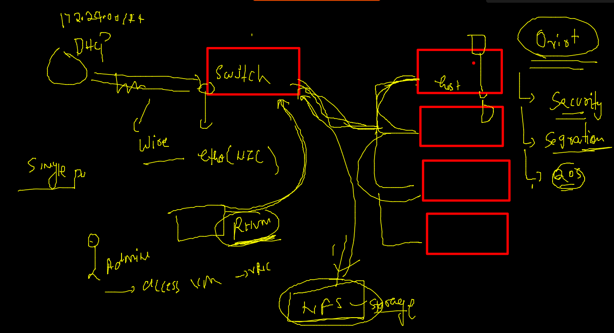

### To create Logical Networking we have SDN --

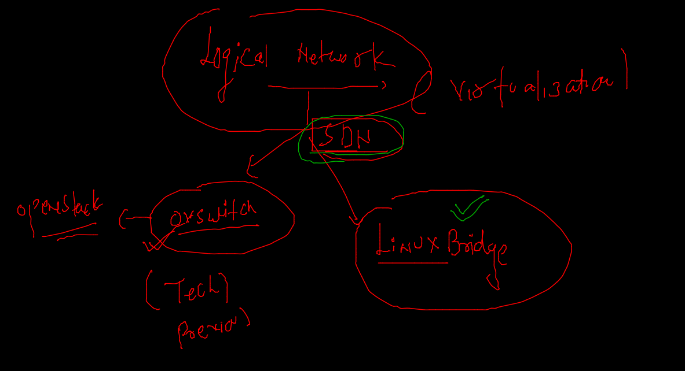

### linux bridge understanding 

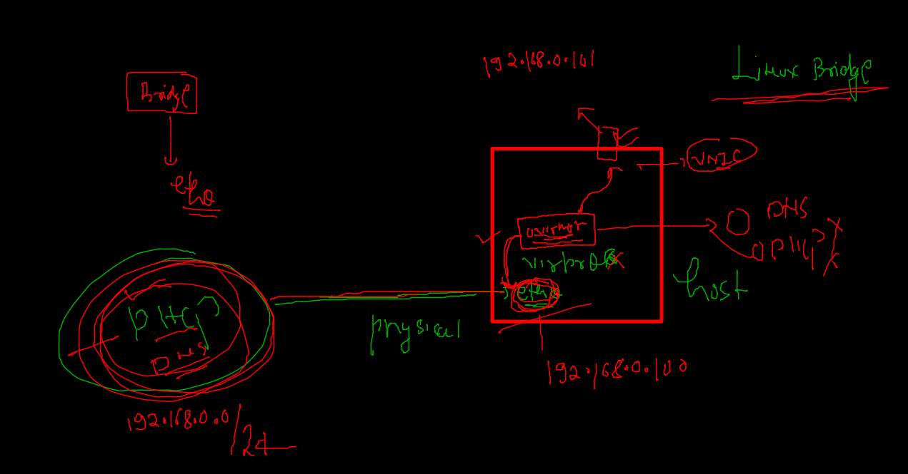

### TYpe of Logical networks

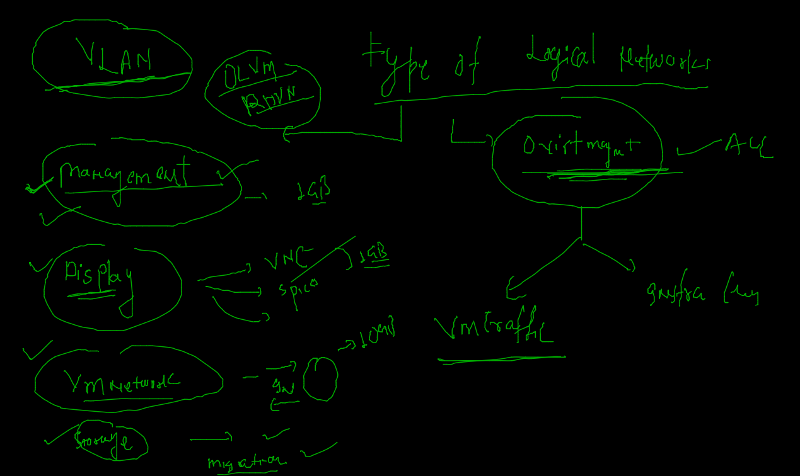

### VLAN concept --for network segrigation 

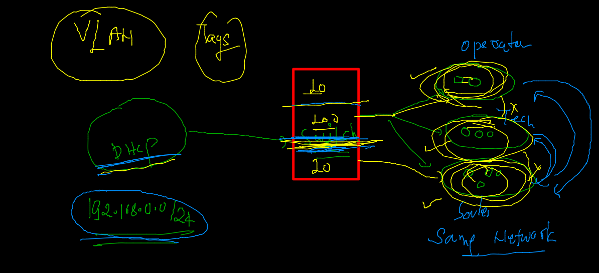

### Logical Network configuration 

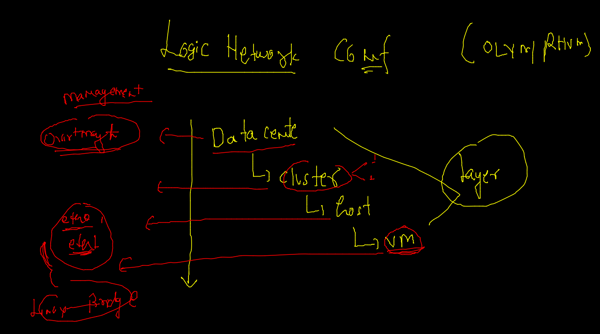

### Task for vm +storge 

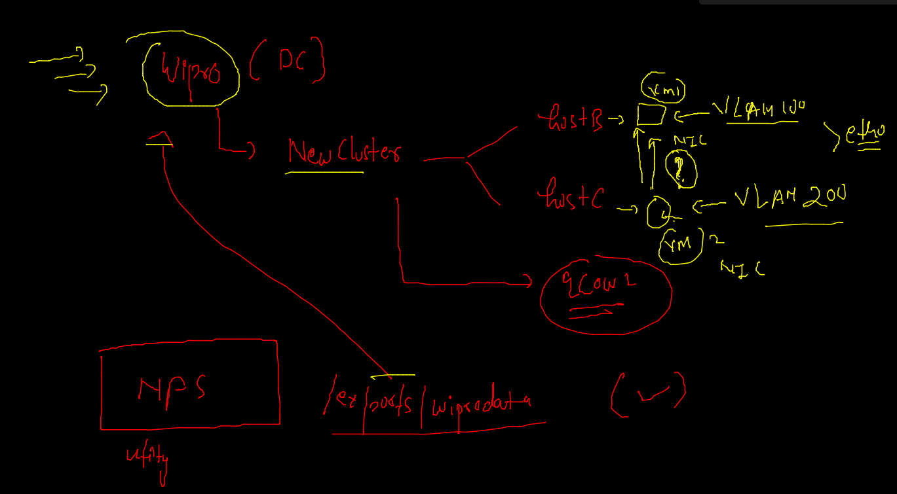

