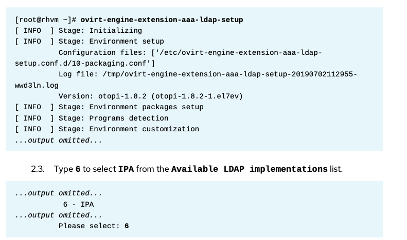
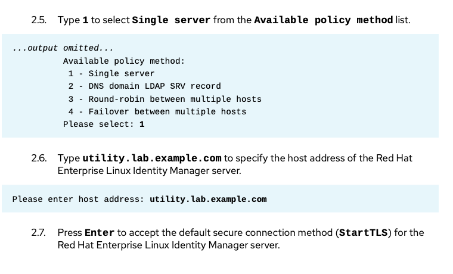
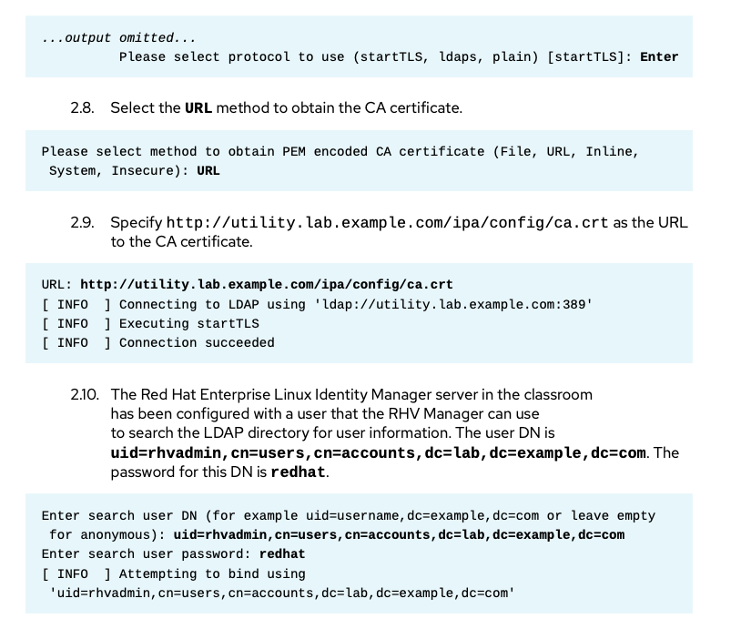
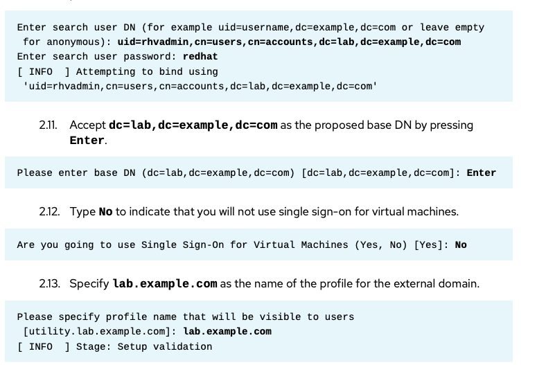
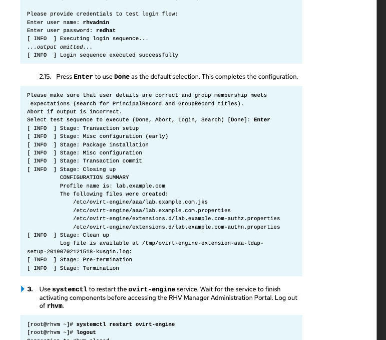

# RHVM / OLVM 

### Creating and attaching storage via manager 

### Kickstart method to boot VM for 

### Integrating RHVM / OLVM with Ldap External server 

### setup with LDap and restart Ovirt-engine 

### Authorization with RBAC 

### rbac is one to many relation -- one user can have multiple roles 

## Hierarical strategy of RBAC 

### ROles type 

### Scaling Infra RHV host / KVM host -- required cluster level role + SPM (storage pool manager) role -- for currently loggedin user 

## LDAP integration steps to RHVM / OLVM 

### step 1 ssh into  rhvm host 

### step 2 RUN below given command 

### step 3 follow options for above command 

====

====

====

===

