# A little understanding about VIrtualization 

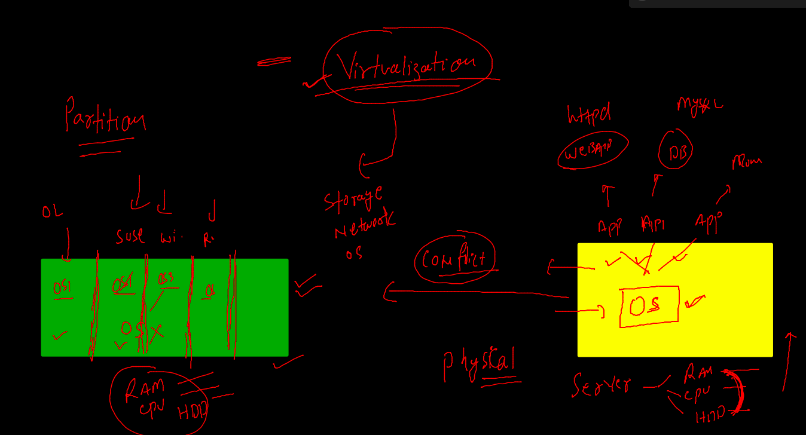

## Intro to Hypervisor 

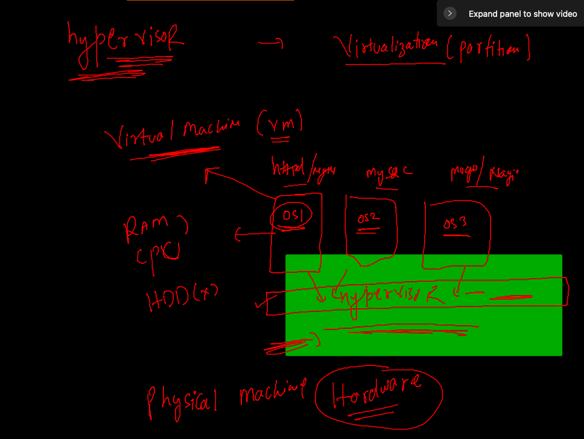

## TYpe 2 Hypervisor 

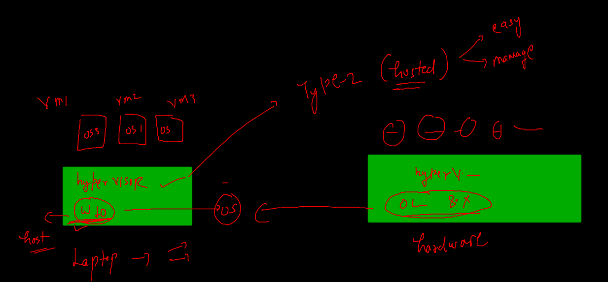

## TYpe 1 Hypervisor 

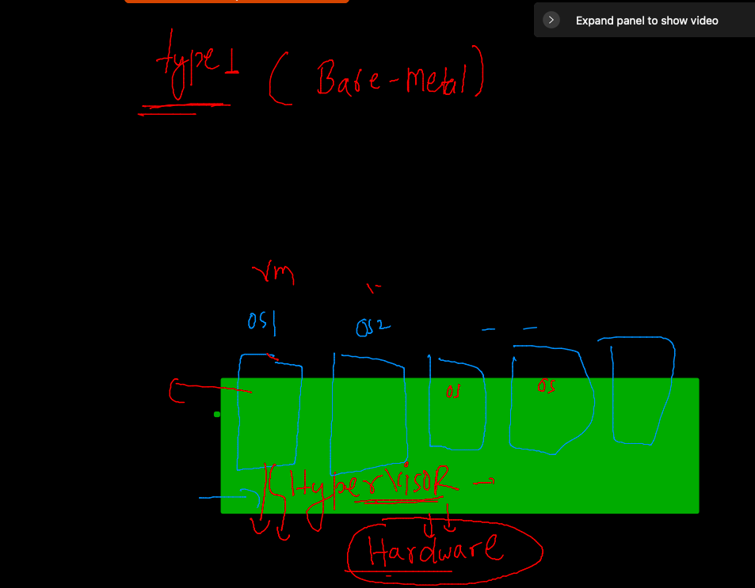

## Hypervisors 

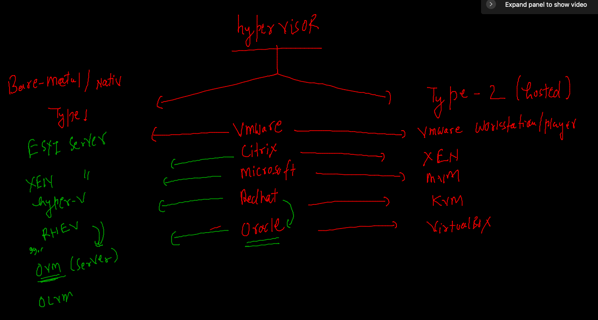

## Checking virtualization features 

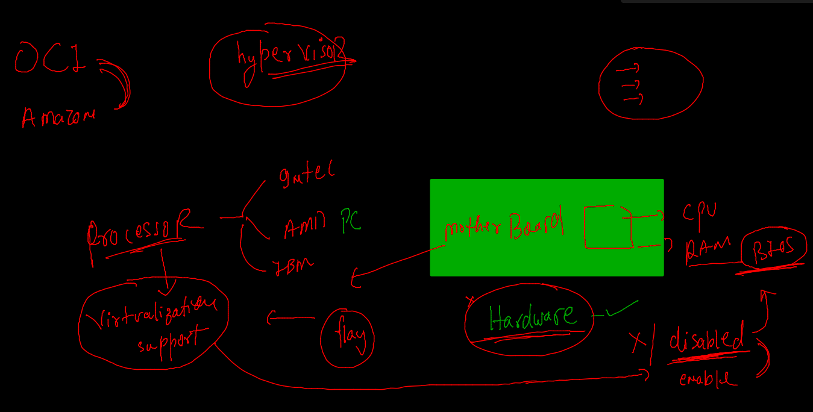

### The real Ovirt COmmunity 

[Ovirt Docs](https://www.ovirt.org/)

### Ovirt for RHVM / OLVM 

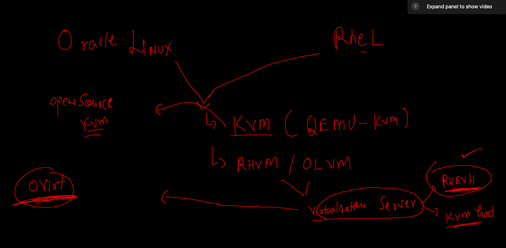

### OL virtaulization manager

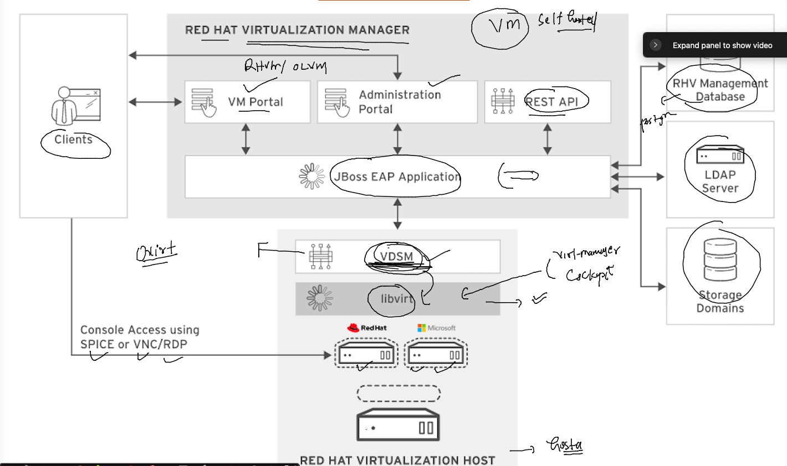

### KVM \ Libvirt | cockpit 

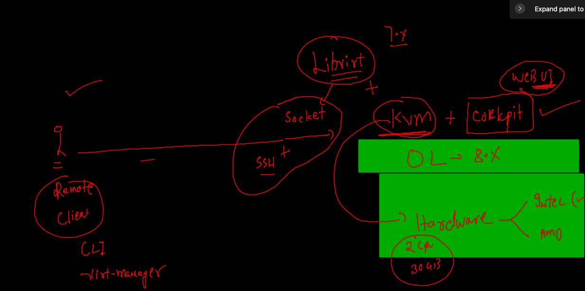

### CHecking things before we install KVM -- ON OL8 

### Checking RAM -- Recommended is 8GB 
```
 free  -m
              total        used        free      shared  buff/cache   available
Mem:          29803         575       28197           8        1030       28819
Swap:          8191           0        8191

```

### Checking CPU support 
```
lscpu 
Architecture:        x86_64
CPU op-mode(s):      32-bit, 64-bit
Byte Order:          Little Endian
CPU(s):              4
On-line CPU(s) list: 0-3
Thread(s) per core:  2
Core(s) per socket:  2
Socket(s):           1
NUMA node(s):        1
Vendor ID:           GenuineIntel
BIOS Vendor ID:      QEMU
CPU family:          6
Model:               85
Model name:          Intel(R) Xeon(R) Platinum 8167M CPU @ 2.00GHz
BIOS Model name:     pc-i440fx-4.2
Stepping:            4
CPU MHz:             1995.312
BogoMIPS:            3990.62
Virtualization:      VT-x
Hypervisor vendor:   KVM
Virtualization type: full
L1d cache:           32K

```

### Checking cpu support 

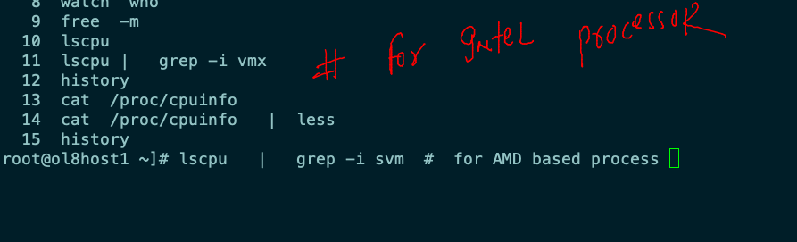

### Installing KVM with Libvirt 

```
 20  dnf  install  qemu-kvm  
   21  history 
   22  yum  install qemu-kvm 
   23  yum  install  libvirt
   24  history 
[root@ol8host1 ~]# systemctl  status libvirtd
● libvirtd.service - Virtualization daemon
   Loaded: loaded (/usr/lib/systemd/system/libvirtd.service; enabled; vendor preset: enabled)
   Active: inactive (dead)
     Docs: man:libvirtd(8)
           https://libvirt.org
[root@ol8host1 ~]# systemctl  start libvirtd
[root@ol8host1 ~]# systemctl  enable libvirtd
[root@ol8host1 ~]# systemctl  status libvirtd
● libvirtd.service - Virtualization daemon
   Loaded: loaded (/usr/lib/systemd/system/libvirtd.service; enabled; vendor preset: enabled)
   Active: active (running) since Wed 2022-01-12 05:43:53 GMT; 13s ago
     Docs: man:libvirtd(8)
           https://libvirt.org
 Main PID: 44202 (libvirtd)
    Tasks: 19 (limit: 32768)
```

### Network interface with DHCP by KVM 

```
# ifconfig
ens3: flags=4163<UP,BROADCAST,RUNNING,MULTICAST>  mtu 9000
        inet 10.0.0.148  netmask 255.255.255.0  broadcast 10.0.0.255
        inet6 fe80::17ff:fe0d:182c  prefixlen 64  scopeid 0x20<link>
        ether 02:00:17:0d:18:2c  txqueuelen 1000  (Ethernet)
        RX packets 18539  bytes 238737178 (227.6 MiB)
        RX errors 0  dropped 0  overruns 0  frame 0
        TX packets 13976  bytes 3050850 (2.9 MiB)
        TX errors 0  dropped 0 overruns 0  carrier 0  collisions 0

lo: flags=73<UP,LOOPBACK,RUNNING>  mtu 65536
        inet 127.0.0.1  netmask 255.0.0.0
        inet6 ::1  prefixlen 128  scopeid 0x10<host>
        loop  txqueuelen 1000  (Local Loopback)
        RX packets 306  bytes 21501 (20.9 KiB)
        RX errors 0  dropped 0  overruns 0  frame 0
        TX packets 306  bytes 21501 (20.9 KiB)
        TX errors 0  dropped 0 overruns 0  carrier 0  collisions 0

virbr0: flags=4099<UP,BROADCAST,MULTICAST>  mtu 1500
        inet 192.168.122.1  netmask 255.255.255.0  broadcast 192.168.122.255
        ether 52:54:00:18:f3:50  txqueuelen 1000  (Ethernet)
        RX packets 0  bytes 0 (0.0 B)
        RX errors 0  dropped 0  overruns 0  frame 0
        TX packets 0  bytes 0 (0.0 B)


```

### Some storage root and conf files by KVM with LIbvirt 

```
 cd  /var/lib/libvirt/
[root@ol8host1 libvirt]# ls
boot  dnsmasq  filesystems  images  network  qemu  swtpm
[root@ol8host1 libvirt]# 
[root@ol8host1 libvirt]# 
[root@ol8host1 libvirt]# cd  /etc/libvirt/
[root@ol8host1 libvirt]# ls
libvirt-admin.conf  nwfilter         qemu.conf            virtlockd.conf     virtnodedevd.conf   virtqemud.conf
libvirt.conf        qemu             secrets              virtlogd.conf      virtnwfilterd.conf  virtsecretd.conf
libvirtd.conf       qemu-lockd.conf  virtinterfaced.conf  virtnetworkd.conf  virtproxyd.conf     virtstoraged.conf
[root@ol8host1 libvirt]# 

```

### ON OL8 installing and configuring Cockpit 

```
  38  dnf  install cockpit  cockpit-machines 
   39  systemctl  start  cockpit 
   40  systemctl  enable  cockpit 
   41  systemctl  status  cockpit 
   42  history 
[root@ol8host1 libvirt]# netstat -ntpl
Active Internet connections (only servers)
Proto Recv-Q Send-Q Local Address           Foreign Address         State       PID/Program name    
tcp        0      0 127.0.0.1:9003          0.0.0.0:*               LISTEN      2408/osms-agent     
tcp        0      0 0.0.0.0:111             0.0.0.0:*               LISTEN      1/systemd           
tcp        0      0 192.168.122.1:53        0.0.0.0:*               LISTEN      44330/dnsmasq       
tcp        0      0 0.0.0.0:22              0.0.0.0:*               LISTEN      8373/sshd           
tcp6       0      0 127.0.0.1:32768         :::*                    LISTEN      2408/osms-agent     
tcp6       0      0 :::9090                 :::*                    LISTEN      1/systemd           
tcp6       0      0 :::111                  :::*                    LISTEN      1/systemd           
tcp6       0      0 :::22                   :::*                    LISTEN      8373/sshd           
[root@ol8host1 libvirt]# firewall-cmd --add-port=9090/tcp --permanent 
success
[root@ol8host1 libvirt]# firewall-cmd --reload 
success
[root@ol8host1 libvirt]# systemctl status firewalld
● firewalld.service - firewalld - dynamic firewall daemon
   Loaded: loaded (/usr/lib/systemd/system/firewalld.service; enabled; vendor preset: enabled)
   Active: active (running) since Wed 2022-01-12 05:20:51 GMT; 55min ago
     Docs: man:firewalld(1)


```

### Image Download location for testing purpose 

[Ubuntu images](https://ftp.riken.jp/Linux/ubuntu-releases/focal/)

[Centos Images] (https://ftp.riken.jp/Linux/centos/7/isos/x86_64/)

### Creating VM in OL8 Host 


## creating vm with virt-install 

### Installing virt-install

```
 dnf install virt-install 
Last metadata expiration check: 0:59:07 ago on Wed 12 Jan 2022 05:43:13 AM GMT.
Dependencies resolved.
=========================================================================================================================
 Package                      Architecture    Version                                       Repository              Size
=========================================================================================================================
Installing:
 virt-install                 noarch          2.2.1-4.0.1.el8                               ol8_appstream          100 k
Installing dependencies:
 genisoimage                  x86_64          1.1.11-39.el8                                 ol8_appstream          316 k
 libosinfo                    x86_64          1.9.0-1.el8                                   ol8_appstream          300 k
 libusal                      x86_64          1.1.11-39.el8                                 ol8_appstream          145 k
 osinfo-db                    noarch          20210903-1.0.1.el8                            ol8_appstream          252 k
 osinfo-db-tools              x86_64          1.9.0-1.el8                                   ol8_appstream           67 k
 python3-argcomplete          noarch      
 
 ```
 
 ### creating a vm using virt-install 
 
 ```
 virt-install --name  myubuntu  --vcpus 1 --memory 4096 --cdrom /mnt/imags/ubuntu-20.04.3-desktop-amd64.iso  --disk size=10
 
 ```
 
 ### VM as a file for Host 
 
 ```
  cd /var/lib/libvirt/
[root@ol8host1 libvirt]# ls
boot  dnsmasq  filesystems  images  network  qemu  swtpm
[root@ol8host1 libvirt]# cd  images/
[root@ol8host1 images]# ls
CentOS-7-x86_64-Minimal-2009.iso  myubuntu.qcow2
[root@ol8host1 images]# ls  -lh 
total 994M
-rw-r--r--. 1 root root 973M Nov  3  2020 CentOS-7-x86_64-Minimal-2009.iso
-rw-------. 1 qemu qemu  11G Jan 12 06:50 myubuntu.qcow2
[root@ol8host1 images]# 
[root@ol8host1 images]# 
[root@ol8host1 images]# grep -i qemu  /etc/passwd
qemu:x:107:107:qemu user:/:/sbin/nologin
[root@ol8host1 images]# 


```

### vm has XMl conf file to store details like its RAM / CPU / network / storage 

```
 cd qemu/
[root@ol8host1 qemu]# ls
myubuntu.xml  networks
[root@ol8host1 qemu]# pwd
/etc/libvirt/qemu
[root@ol8host1 qemu]# vim myubuntu.xml 

```

### summary 

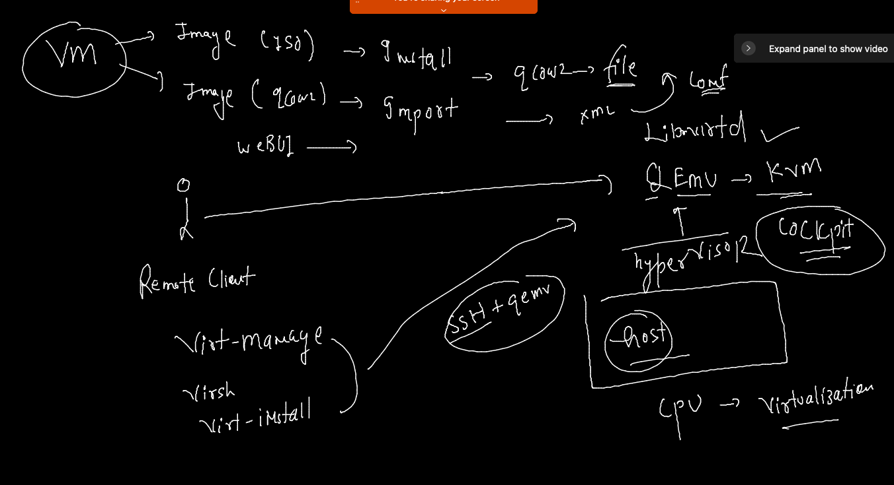


 
