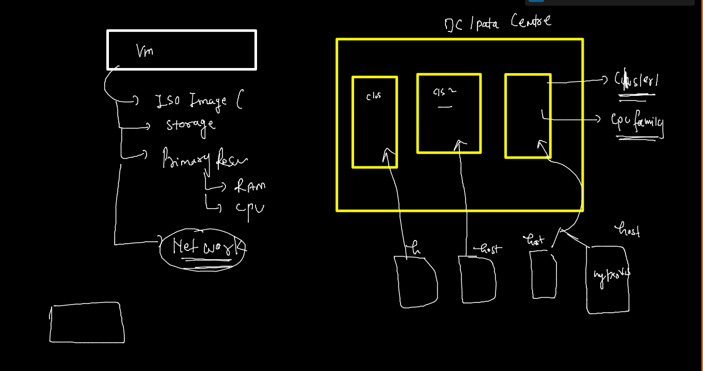
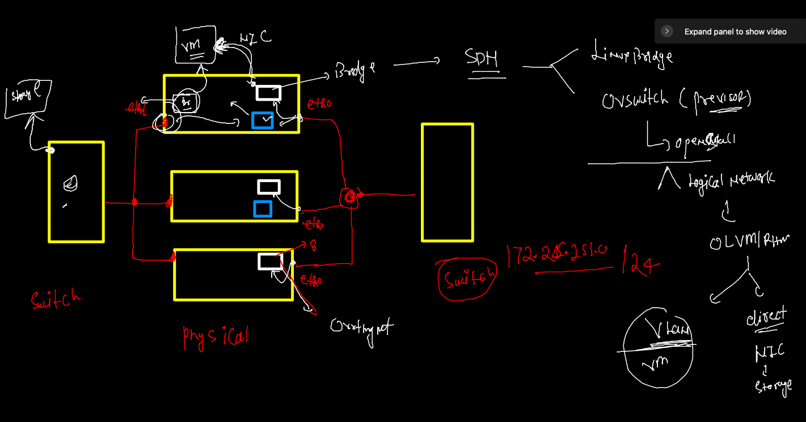
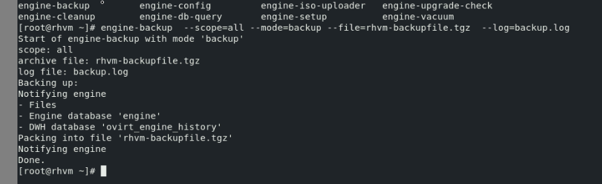

# OLVM12thjan2022

## Lab setup --


### OLVM / RHVM -- way of managing host and VMs 



### OLVM / RHVM -- understanding with VDSM 


### creating storage domain 

### NFS is configured 

### checking hypervisors are connected with NFS 


### VM and storage networking 



### backup of engine --



### engine clean up for restore purpose 

```
engine-cleanup 
```

### restore 


