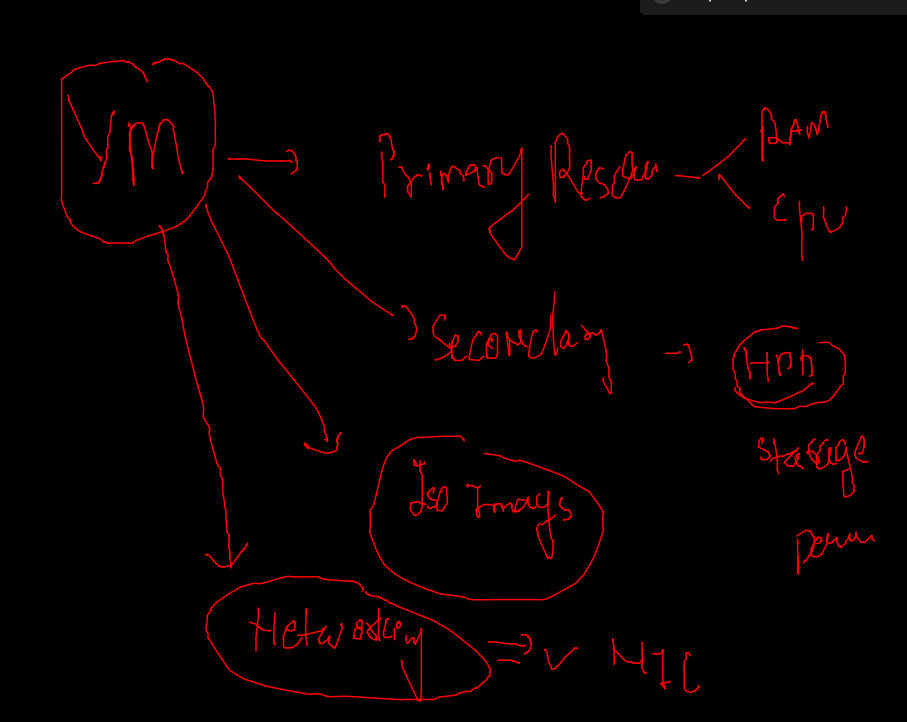

# KVM host problem statement 

### VM creation / planning / management is a problem in current view 


### RHVM / OLVM intro 


###  pic 


### RHVM / OLVM way of handling hypervisor and VMS 


### RHVM / OLVM with Iso and data domain 


### OLVM / RHVM setup 


### OLVM setup on OL7.x

[OLVM standalone setup](https://docs.oracle.com/en/virtualization/oracle-linux-virtualization-manager/getstart/manager-install.html)

### YUm configuration details 

[Yum config](https://yum.oracle.com/getting-started.html)

### ON OL7 setup engine history 

```
13  yum update -y
   14  history 
   15  yum-config-manager --enable ol7_latest
   16  cd /etc/yum.repos.d/
   17  ls
   18  history 
   19  yum install oracle-ovirt-release-el7
   20  cd /var/cache/yum/
   21  ls
   22  yum clean all
   23  yum repolist
   24  yum-config-manager --enable repository
   25  yum-config-manager --disable ovirt-4.2
   26  yum-config-manager --disable ovirt-4.2-extra
   27  history 
   28  yum install ovirt-engine
   29  history 
   30  engine-setup 
   31  export LC_ALL=en_US.UTF-8
   32  engine-setup 

```

### checking engine service 

```
 systemctl status ovirt-engine
● ovirt-engine.service - oVirt Engine
   Loaded: loaded (/usr/lib/systemd/system/ovirt-engine.service; enabled; vendor preset: disabled)
   Active: active (running) since Thu 2022-01-13 06:04:53 GMT; 5min ago
 Main PID: 16625 (ovirt-engine.py)
   CGroup: /system.slice/ovirt-engine.service
           ├─16625 /usr/bin/python /usr/share/ovirt-engine/services/ovirt-engine/ovirt-engine.py --redirect-output --sys...
           └─16706 ovirt-engine -server -XX:+TieredCompilation -Xms7450M -Xmx7450M -Xss1M -Djava.awt.headless=true -Dsun...

Jan 13 06:04:52 olvmhost systemd[1]: Starting oVirt Engine...
Jan 13 06:04:52 olvmhost ovirt-engine.py[16625]: 2022-01-13 06:04:52,583+0000 ovirt-engine: INFO _detectJBossVersio...al=36
Jan 13 06:04:53 olvmhost ovirt-engine.py[16625]: 2022-01-13 06:04:53,659+0000 ovirt-engine: INFO _detectJBossVersio... '[]'
Jan 13 06:04:53 olvmhost systemd[1]: Started oVirt Engine.
Hint: Some lines were ellipsized, use -l to show in full.
[root@olvmhost ~]# 
[root@olvmhost ~]# 
[root@olvmhost ~]# systemctl enable ovirt-engine

```

### Distributed Storage with GFS and CEPH 


### Understanding Redhat Labs 


### OLVM / RHVM in more detail 


### In RHVM labs installing Virtualization host 

### Lab 1 checking rhvm host networking checks 

### In workstation student /student 

```
lab insallation-install-rhvh start 
```

### checking workstation browser by openning rhvHost cockpit and ping 

### finish that 

```
lab insallation-install-rhvh start

```

### Install Selfhosted RHVM -- Redhat Virtualization manager 

```
lab install-rhvm start

```

### Note : in workstation web browser open rhvm port and check things 

### finish 

```
lab install-rhvm finish 
```


## TO create VM using OLVM/RHVM we need things given below 



### ON utility server check nfs share owner and group permission 


### Self Hosted OLVM 

```
 10  mkfs.xfs  /dev/sda2 -f
   11  mount /dev/sda2  /var/tmp/
   12  df -h 
   13  yum-config-manager --enable ol7_latest
   14  yum install oracle-ovirt-release-el7
   15  yum-config-manager --enable repository
   16  yum-config-manager --disable ovirt-4.2
   17  yum-config-manager --disable ovirt-4.2-extra
   18  yum install ovirt-hosted-engine-setup -y
   19  yum install ovirt-engine-appliance -y

```

