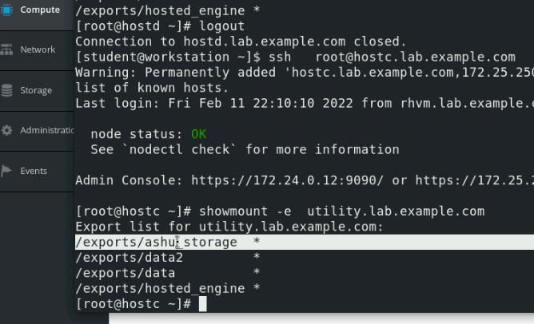

# all Manual setup for lab 

## Ovirt-engine connection to hypervisor using -- VDSM 

### checking hypervisor host 

### more info about HYpervisor logs 

### maintaining disk 

### NFS configured 

